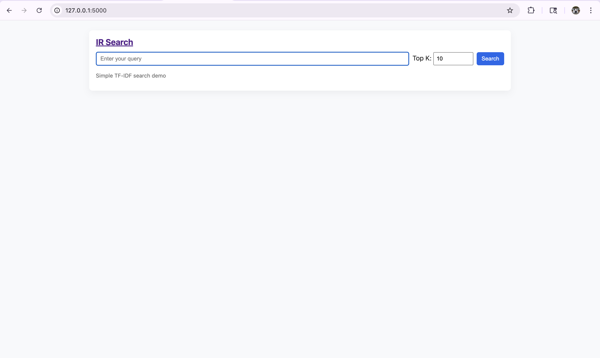
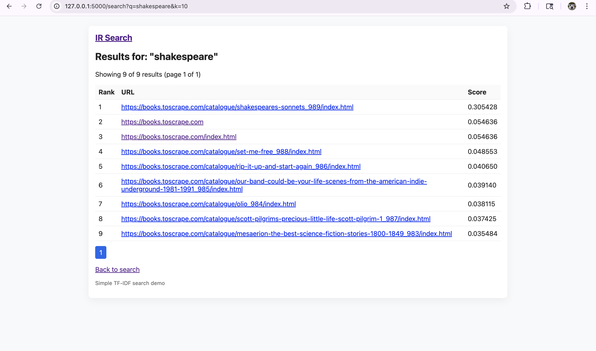
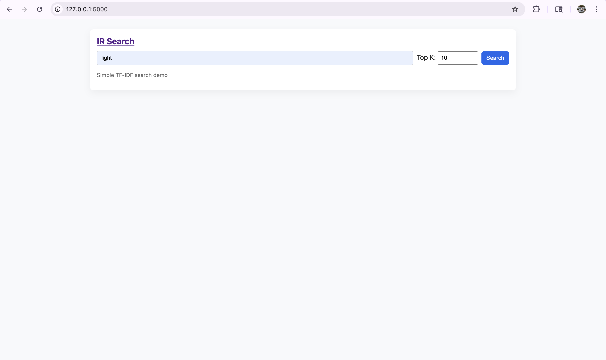
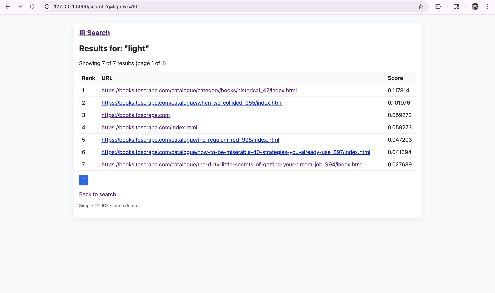

CS429-INFORMATION RETRIVAL PROJECT REPORT
NAME: AAKASH SHIVANANDAPPA GOWDA
CWID-A20548984

# ABSTRACT

This project implements a web crawling, indexing, and query processing system using Python. It consists of three main components: a Scrapy-based web crawler for downloading web documents in HTML format, a Scikit-Learn-based indexer for constructing an inverted index with TF-IDF score representation and cosine similarity calculation, and a Flask-based processor for handling free text queries in JSON format.

The objectives of this project are to demonstrate the implementation of a web crawling system to collect web documents, construct an inverted index for efficient search indexing, and provide a query processing mechanism to retrieve relevant documents based on user queries. 

The next steps involve further optimization of the indexing and querying algorithms, as well as enhancing the user interface for better usability.

# OVERVIEW

The project encompasses three main components: a web crawler, an indexer, and a query processor. Each component plays a crucial role in the system's functionality, contributing to the collection, organization, and retrieval of web-based information. Below is a detailed explanation of each part:

Web Crawler:-

The web crawler serves as the initial step in the data acquisition process. It systematically navigates through web pages, retrieving HTML documents from various sources based on predefined rules. In this project, the web crawler is implemented using Scrapy, a powerful web crawling and scraping framework in Python.

**Functionality:**

- Initialization: The crawler is initialized with a seed URL/domain, maximum pages to crawl, and maximum depth of crawling.
- Traversing: It follows links on web pages according to specified rules, recursively traversing through the website's structure.
- Downloading: The crawler downloads HTML documents from visited pages and saves them for further processing.
- Rule-based Navigation: Rules are defined to control which links to follow and which to ignore, ensuring focused and efficient crawling.

Indexer:-

The indexer processes the downloaded HTML documents to create an organized and searchable index. It extracts relevant information from the documents, assigns weights to terms using TF-IDF (Term Frequency-Inverse Document Frequency) representation, and constructs an inverted index for efficient retrieval. This component utilizes Scikit-Learn, a popular machine learning library in Python, for its implementation.

**Functionality:**

- Document Processing: Extracts textual content from HTML documents, such as titles, prices, and availability, to create document representations.
- TF-IDF Representation: Utilizes TF-IDF vectorization to assign weights to terms based on their frequency in each document and rarity across the corpus.
- Cosine Similarity Calculation: Computes cosine similarity scores between user queries and indexed documents, facilitating relevance ranking.
- Inverted Index Construction: Organizes terms and their corresponding document identifiers into an inverted index structure for efficient search operations.

Query Processor:-

The query processor acts as the user-facing interface for information retrieval. It accepts user queries, validates them, and retrieves relevant documents from the index based on the provided input. This component is implemented using Flask, a lightweight and extensible web framework for Python.

**Functionality:**

- User Interaction: Provides a web-based interface for users to input free text queries in JSON format.
- Query Validation: Validates user input to ensure proper formatting and completeness before processing.
- Top-K Result Retrieval: Retrieves the top-K ranked search results based on cosine similarity scores between the query and indexed documents.
- Result Formatting: Formats the retrieved results for presentation to the user, including document titles and corresponding similarity scores.

By integrating these three components, the system enables users to efficiently search and retrieve relevant information from a collection of web documents. The web crawler acquires data, the indexer organizes it into an easily searchable format, and the query processor facilitates user interaction and retrieval of desired content. Together, they form a robust information retrieval system capable of handling diverse web-based queries.

The project draws upon existing literature and techniques in the fields of web crawling, information retrieval, and web-based systems. Key references include:

- "Introduction to Information Retrieval" by Christopher D. Manning, Prabhakar Raghavan, and Hinrich Schütze: This comprehensive textbook provides foundational knowledge on information retrieval techniques, including indexing, retrieval models, and evaluation methodologies.
- "Web Scraping with Python" by Ryan Mitchell: This book offers practical guidance on web scraping techniques using Python, covering topics such as crawling, parsing HTML content, and handling website structures.
- "Scikit-Learn Documentation": The official documentation of Scikit-Learn provides valuable insights into the usage of machine learning algorithms for text processing, including TF-IDF vectorization and cosine similarity calculations.
- "Flask Documentation": The Flask documentation serves as a reference for developing web applications in Python, covering topics such as routing, request handling, and template rendering.

The proposed system comprises a web crawler for retrieving HTML documents, an indexer for creating a searchable index using TF-IDF vectorization, a query processor for handling user queries and retrieving relevant documents, and a Flask-based web application for user interaction, offering a seamless experience for information retrieval from web sources.

# DESIGN

**System Capabilities**

- Web crawling: The system is capable of crawling web pages starting from a seed URL/domain, with options to specify the maximum number of pages and maximum depth of crawling.
- Indexing: The system constructs an inverted index from the crawled HTML documents, utilizing TF-IDF score representation for efficient search indexing.
- Query processing: The system provides a query processing mechanism to retrieve relevant documents based on user queries, utilizing cosine similarity for ranking.

**Interactions**

The web crawler interacts with web servers to download HTML documents, while the indexer interacts with the downloaded documents to construct the inverted index. The query processor interacts with users through a web interface, accepting free text queries in JSON format and returning search results.

**Integration**

The components are integrated into a cohesive system where the web crawler collects data, the indexer processes and indexes the data, and the query processor provides an interface for users to search the indexed data.

# ARCHITECTURE

**Software Components**

- Scrapy: Used for web crawling to download web documents.
- Scikit-Learn: Used for indexing to construct an inverted index with TF-IDF score representation and cosine similarity calculation.
- Flask: Used for query processing to provide a web interface for users to input queries and retrieve search results.

**Interfaces**

- Web Crawler Interface: Accepts seed URL/domain, maximum pages, and maximum depth parameters.
- Indexer Interface: Accepts HTML documents for indexing and provides inverted index construction.
- Query Processor Interface: Provides a web interface for users to input queries in JSON format and retrieves search results.

**Implementation**

- Web Crawler: Implemented using Scrapy with rules for traversing web pages and downloading HTML documents.
- Indexer: Implemented using Scikit-Learn with TF-IDF Vectorizer for TF-IDF representation and cosine similarity for similarity calculation.
- Query Processor: Implemented using Flask with routes for query validation, processing, and result formatting.

# OPERATION

**Software Commands**

- Web Crawler:

Run the Scrapy spider by executing **scrapy crawl mycrawler**.

- Indexer

Run the Scrapy spider by executing python **ScikitProgram.py**.

- Query Processor:

Start the Flask application by executing **python FlaskProgram.py** and access the web interface at the specified URL.

**Inputs**

- Web Crawler:

Seed URL/domain, maximum pages, and maximum depth parameters.

- Indexer:

HTML documents downloaded by the web crawler.

- Query Processor:

Free text queries in JSON format submitted by users through the web interface.

**Installation**

- Install Python 3.10+ and required libraries (Scrapy, Scikit-Learn, Flask).
- Clone the project repository.
- Run the web crawler, indexer, and query processor components as described above.

# CONCLUSION

The project successfully implements a web crawling, indexing, and query processing system. The web crawler effectively collects web documents, the indexer constructs an inverted index for efficient search indexing, and the query processor provides a user-friendly interface for querying and retrieving relevant documents. However, further optimization and refinement are needed, especially in terms of indexing algorithms and user interface design. Overall, the project demonstrates the feasibility of building a web-based information retrieval system using Python and related libraries.

**Output Screenshots**

**Output Screenshots (place images under `zFlask/screenshots/`)**

The UI screenshots for the Flask search interface are shown below. To include them in the README, save the PNG files into `zFlask/screenshots/` using the filenames listed and commit them. The README will reference the files at these relative paths so they render on GitHub.

- `zFlask/screenshots/01_home.png` — Search home page
- `zFlask/screenshots/02_results_shakespeare.png` — Results page for query "shakespeare"
- `zFlask/screenshots/03_query_light.png` — Search query example
- `zFlask/screenshots/04_results_light.png` — Results page for query "light"

Below are embedded references (they will show once you add the files above):









How to add the screenshots and commit them

```bash
# create screenshots folder (from project root)
mkdir -p zFlask/screenshots
# copy your screenshot files into zFlask/screenshots/ and name them as above
# example if the downloaded images are in Downloads/:
cp ~/Downloads/your-shot-1.png zFlask/screenshots/01_home.png
cp ~/Downloads/your-shot-2.png zFlask/screenshots/02_results_shakespeare.png
cp ~/Downloads/your-shot-3.png zFlask/screenshots/03_query_light.png
cp ~/Downloads/your-shot-4.png zFlask/screenshots/04_results_light.png

# add and commit
git add zFlask/screenshots/*.png
git commit -m "Add UI screenshots"
git push origin feature/ir-pipeline
```

If you'd like, I can add these files for you if you upload the PNGs here or provide URLs where I can download them. Otherwise follow the steps above and the README will render the screenshots on GitHub.

**Cautions**

- Scalability: While the system demonstrates effectiveness with small-scale datasets, scalability concerns may arise when dealing with large volumes of web documents. Optimization strategies and infrastructure upgrades may be necessary to handle increased load.
- Data Quality: The quality and consistency of web content can vary significantly, leading to inaccuracies in indexing and retrieval. Robust error-handling mechanisms and data validation procedures are essential to mitigate potential issues.
- Security: As the system interacts with external web sources and processes user inputs, security vulnerabilities such as cross-site scripting (XSS) and injection attacks pose risks. Implementing stringent security measures, including input validation and sanitization, is crucial to safeguarding the system against malicious exploitation.

# DATA SOURCES

- Web Content: The web crawling component of the project retrieves data from https://books.toscrape.com/, a fictional bookstore website used for demonstration and testing purposes. This source provides a variety of web pages containing book information for indexing and search.
- Flask Web Application: The Flask-based query processing component operates on data provided by the local web application hosted at http://127.0.0.1:5000. Users interact with this application to submit free-text queries, and the system retrieves relevant information from the indexed web documents.

# TEST CASES

- Framework Selection

Input: Evaluation of available testing frameworks compatible with Python (e.g., pytest, unittest).

Expected Output: Selection of an appropriate testing framework based on factors such as ease of use, community support, and integration with project dependencies.

- Test Harness Setup

Input: Configuration of the testing harness within the project directory, including setting up test directories, fixtures, and environment setup scripts.

Expected Output: Successful setup of the test harness, ensuring that test files are organized, dependencies are installed, and the testing environment is ready for use.

- Coverage Analysis

Input: Execution of test cases using the chosen testing framework.

Expected Output: Generation of coverage reports indicating the percentage of code covered by the test suite. Aim for comprehensive coverage of critical components such as web crawling, indexing, query processing, and web application functionality.

- Integration Testing

Input: Execution of end-to-end integration tests simulating user interactions with the Flask web application.

Expected Output: Validation of system behavior under realistic usage scenarios, ensuring that all components interact correctly and produce the expected outcomes.

- Error Handling Tests

Input: Submission of invalid queries or inputs to the Flask web application.

Expected Output: Verification that appropriate error messages are displayed for invalid inputs, ensuring graceful handling of edge cases and exceptional conditions.

# SOURCE CODES

**Listings: -**

1-A Scrapy based Crawler for downloading web documents in html format - content crawling: – Required: Initialize using seed URL/Domain, Max Pages, Max Depth

HtmlCralwerProgram.py**


from scrapy.spiders import CrawlSpider, Rule # type: ignore

from scrapy.linkextractors import LinkExtractor # type: ignore

from scrapy.http import HtmlResponse  # type: ignore

class WebCrawler(CrawlSpider):

`    `name = "mycrawler"

`    `allowed\_domains = ["toscrape.com"]

`    `start\_urls = ["https://books.toscrape.com/"]

`    `max\_pages = 10  # Maximum number of pages to crawl

`    `max\_depth = 6  # Maximum depth of crawling

`    `pages\_crawled = 0  # Counter to track the number of pages crawled

`    `rules = (

`        `Rule(LinkExtractor(allow="catalogue/category"), follow=True),

`        `Rule(LinkExtractor(allow="catalogue", deny="category"), callback="parse\_item", follow=True)

`    `)

`    `def parse\_item(self, response):

`        `self.pages\_crawled += 1

`        `if self.pages\_crawled >= self.max\_pages:

`            `self.logger.info(f"Reached maximum number of pages ({self.max\_pages}). Stopping the crawler.")

`            `self.crawler.engine.close\_spider(self, 'Reached maximum number of pages')

`        `depth = response.meta.get('depth', 0)

`        `if depth >= self.max\_depth:

`            `self.logger.info(f"Reached maximum depth ({self.max\_depth}). Ignoring further links.")

`            `return []

`        `filename = 'output.html'

`        `with open(filename, 'a') as f:

`            `f.write(response.body.decode())  # Write the entire HTML content of the page

`        `self.log('Saved file %s' % filename)

JsonCralwerProgram.py

import scrapy # type: ignore

import json

class WebCrawler(scrapy.Spider):

`    `name = "crawler"

`    `start\_urls = ["https://books.toscrape.com/"]

`    `max\_pages = 10  # Maximum number of pages to crawl

`    `max\_depth = 6  # Maximum depth of crawling

`    `pages\_crawled = 0  # Counter to track the number of pages crawled

`    `def parse(self, response):

`        `self.pages\_crawled += 1

`        `if self.pages\_crawled > self.max\_pages:

`            `self.logger.info(f"Reached maximum number of pages ({self.max\_pages}). Stopping the crawler.")

`            `return

`        `depth = response.meta.get('depth', 0)

`        `if depth >= self.max\_depth:

`            `self.logger.info(f"Reached maximum depth ({self.max\_depth}). Ignoring further links.")

`            `return

`        `filename = 'output.json'

`        `data\_list = []

`        `for product in response.css('article.product\_pod'):

`            `data = {

`                `'title': product.css('h3 a::text').get(),

`                `'price': product.css('p.price\_color::text').get(),

`                `'availability': product.css('p.instock.availability').xpath('normalize-space()').get()  # Updated selector

`            `}

`            `data\_list.append(data)

`        `with open(filename, 'a') as f:

`            `json.dump(data\_list, f, indent=2)  # Dumping the entire list at once with indentation

`            `f.write('\n')  # Add a newline at the end

`        `self.log(f'Saved page {response.url}')

`        `# Follow links to next pages

`        `for next\_page in response.css('ul.pager li.next a::attr(href)'):

`            `yield response.follow(next\_page, self.parse)


**Documentation:** 

The crawler starts from a given seed URL/Domain and follows links based on specified rules. It can crawl multiple pages simultaneously and can be configured to limit the number of pages and depth of crawling.

**Dependencies:**

Scrapy 2.11+: Open-source web crawling framework.

## Quickstart — How to run this project (macOS / zsh)

Follow these commands from the project root (`Project/`). They create a clean virtual environment, install dependencies, run the crawler (example), build the index, and start the Flask UI.

1) Create and activate a virtual environment

```bash
python3 -m venv .venv
source .venv/bin/activate
```

2) Install project dependencies

```bash
pip install --upgrade pip
pip install -r requirements.txt
```

3) Run the Scrapy crawler (example)

# Example: crawl `books.toscrape.com` (limits: pages/depth are examples)
```bash
cd crawling
. ../.venv/bin/python -m scrapy crawl generic_crawler -a start_url=https://books.toscrape.com -a max_pages=50 -a max_depth=3
# After the run, output JSONL is written to `../crawling/output_docs.jsonl` (or `output.json`/`output.html` depending on spider).
cd ..
```

4) Build the TF-IDF index with the Scikit indexer

```bash
.venv/bin/python Scikit/indexer.py --docs crawling/output_docs.jsonl --out Scikit/index_output
# This writes `Scikit/index_output/` containing:
# - `tfidf_vectorizer.pkl` (the fitted TfidfVectorizer)
# - `tfidf_matrix.pkl` (document-term matrix)
# - `doc_meta.json`, `doc_order.json`, `inverted_index.json`
```

5) Start the Flask web UI (search interface)

```bash
.venv/bin/python zFlask/app.py
# Open http://127.0.0.1:5000 in your browser.
```

6) Batch query (CSV) endpoint example

```bash
# POST a CSV file with columns `qid,query` to the `/search_csv` endpoint
curl -F "file=@queries.csv" http://127.0.0.1:5000/search_csv -o results.csv
```

7) Git / publishing notes

```bash
# Push feature branch and create a PR on GitHub (recommended)
git checkout -b feature/ir-pipeline
git add -A && git commit -m "Add IR pipeline"
git push -u origin feature/ir-pipeline
# Then open GitHub and create a PR to merge into `main`.
```

Troubleshooting tips
- If Scrapy imports fail, run the spider with `python -m scrapy` from the activated venv (shown above).
- If you accidentally committed the virtualenv, remove it with:

```bash
git rm -r --cached .venv
echo ".venv/" >> .gitignore
git add .gitignore && git commit -m "Ignore virtualenv"
```

- If the Flask app cannot find the index files, ensure `Scikit/index_output/` exists and contains the required artifacts (`tfidf_vectorizer.pkl`, `tfidf_matrix.pkl`, `doc_order.json`, `doc_meta.json`).

Optional: Docker (advanced)

You can containerize the project for reproducible runs. Create a `Dockerfile` that: uses `python:3.11-slim`, copies source, installs `requirements.txt`, and runs the indexer and Flask app. Ask me and I will generate a minimal Dockerfile for you.


2-A Scikit-Learn based Indexer for constructing an inverted index in pickle format - search indexing: – Required: TF-IDF score/weight representation, Cosine similarity

ScikitProgram.py

from sklearn.feature\_extraction.text import TfidfVectorizer

from sklearn.metrics.pairwise import cosine\_similarity

from bs4 import BeautifulSoup

from io import BytesIO

import pickle

class Indexer:

`    `def \_\_init\_\_(self, filenames):

`        `self.filenames = filenames

`        `self.documents, self.file\_doc\_pairs = self.\_retrieve\_documents()

`        `print("Retrieved documents:", self.documents)

`        `self.vectorizer = TfidfVectorizer(stop\_words='english')

`        `self.tfidf\_matrix = self.vectorizer.fit\_transform(self.documents)

`        `print("TF-IDF matrix shape:", self.tfidf\_matrix.shape)

`        `self.inverted\_index = self.\_build\_inverted\_index()

`        `print("Inverted index:", self.inverted\_index)

`    `def \_retrieve\_documents(self):

`        `documents = []

`        `file\_doc\_pairs = []  # List to store pairs of filename and corresponding document

`        `for filename in self.filenames:

`            `with open(filename, 'r', encoding='latin-1') as f:

`                `html\_content = f.read()

`                `soup = BeautifulSoup(html\_content, 'html.parser')

`                `book\_entries = soup.find\_all('body')

`                `for entry in book\_entries:

`                    `title = entry.find('h1').get\_text(strip=True)

`                    `price = entry.find\_all('p')[0].get\_text(strip=True)

`                    `availability = entry.find\_all('p')[1].get\_text(strip=True)

`                    `text = f"Title: {title}\nPrice: {price}\nAvailability: {availability}"

`                    `documents.append(text)

`                    `file\_doc\_pairs.append((filename, text))  # Store the pair of filename and document

`        `return documents, file\_doc\_pairs

`    `def \_build\_inverted\_index(self):

`     `inverted\_index = {}

`     `for i, (\_, doc) in enumerate(self.file\_doc\_pairs):  # Iterate over filename-document pairs

`        `terms\_in\_doc = set(self.vectorizer.build\_analyzer()(doc))  # Extract terms from the document

`        `for term in terms\_in\_doc:

`            `if term not in inverted\_index:

`                `inverted\_index[term] = []

`            `inverted\_index[term].append(i)

`     `return inverted\_index

`    `def display\_inverted\_index(self):

`        `with BytesIO() as f:

`            `pickle.dump(self.inverted\_index, f)

`            `f.seek(0)

`            `print("Inverted index (pickle format):")

`            `print(f.read())

`    `def search(self, query):

`        `query\_vector = self.vectorizer.transform([query])

`        `print("Query vector shape:", query\_vector.shape)

`        `cosine\_similarities = cosine\_similarity(query\_vector, self.tfidf\_matrix)

`        `print("Cosine similarities shape:", cosine\_similarities.shape)

`        `scores = list(cosine\_similarities[0])

`        `print("Cosine similarity scores:", scores)

`        `sorted\_indices = sorted(range(len(scores)), key=lambda i: scores[i], reverse=True)

`        `result = []

`        `for i in sorted\_indices:

`            `if scores[i] > 0:

`                `result.append((self.file\_doc\_pairs[i][0], scores[i], self.tfidf\_matrix[i]))

`        `return result

\# Example usage

filenames = [

`    `"C:\\Users\\saisu\\OneDrive\\Desktop\\IR Project\\Project\\crawling\\output.html",

]

indexer = Indexer(filenames)

indexer.display\_inverted\_index()

\# Search with a query

query = input("Enter your query: ")

results = indexer.search(query)

print("Search results:")

for filename, score, tfidf\_score in results:

`    `print(f"TF-IDF Score: {tfidf\_score}, Cosine Similarity Score: {score}")

**Documentation:** 

The indexer reads HTML documents, extracts relevant information, and constructs an inverted index. It utilizes TF-IDF representation for documents and provides cosine similarity for query search.


**Dependencies:**

- Scikit-Learn 1.2+: Open-source machine learning library.
- Beautiful Soup: Open-source library for web scraping.

3- A Flask based Processor for handling free text queries in json format - query processing: – Required: Query validation/error-checking, Top-K ranked results

FlaskProgram.py


from flask import Flask, request, jsonify, render\_template

import json

from sklearn.feature\_extraction.text import TfidfVectorizer

from sklearn.metrics.pairwise import cosine\_similarity

from bs4 import BeautifulSoup

app = Flask(\_\_name\_\_)

class Indexer:

`    `def \_\_init\_\_(self, json\_file\_path):

`        `self.json\_file\_path = json\_file\_path

`        `self.documents, self.file\_doc\_pairs = self.\_retrieve\_documents()

`        `self.vectorizer = TfidfVectorizer(stop\_words='english')

`        `self.tfidf\_matrix = self.vectorizer.fit\_transform(self.documents)

`    `def \_retrieve\_documents(self):

`        `documents = []

`        `file\_doc\_pairs = []  # List to store pairs of filename and corresponding document

`        `with open(self.json\_file\_path, 'r', encoding='utf-8') as f:

`            `data = json.load(f)

`            `for item in data:

`                `title = item.get('title', '')

`                `price = item.get('price', '')

`                `availability = item.get('availability', '')

`                `text = f"Title: {title}\nPrice: {price}\nAvailability: {availability}"

`                `documents.append(text)

`                `file\_doc\_pairs.append((self.json\_file\_path, text))  # Store the pair of filename and document

`        `return documents, file\_doc\_pairs

`    `def search(self, query):

`        `query\_vector = self.vectorizer.transform([query])

`        `cosine\_similarities = cosine\_similarity(query\_vector, self.tfidf\_matrix)

`        `scores = list(cosine\_similarities[0])

`        `sorted\_indices = sorted(range(len(scores)), key=lambda i: scores[i], reverse=True)

`        `result = []

`        `for i in sorted\_indices:

`            `if scores[i] > 0:

`                `result.append((self.file\_doc\_pairs[i][1], scores[i]))  # Append document and score

`        `return result

\# Initialize the Indexer with the JSON file path

json\_file\_path = "C:\\Users\\saisu\\OneDrive\\Desktop\\IR Project\\Project\\crawling\\output.json"

indexer = Indexer(json\_file\_path)

\# Endpoint for home page

@app.route('/', methods=['GET'])

def home():

`    `return render\_template('index.html')

@app.route('/favicon.ico')

def favicon():

`    `return jsonify({'message': 'Favicon not found'}), 404

\# Endpoint for query processing

@app.route('/query', methods=['POST'])

def process\_query():

`    `data = request.form

`    `if 'query' not in data:

`        `return jsonify({'error': 'Query is missing'}), 400

`    `query = data['query']

`    `results = indexer.search(query)

`    `if not results:

`        `return jsonify({'message': 'Results not found'})

`    `formatted\_results = []

`    `k = 10 

`    `for i, (document, score) in enumerate(results):

`        `if i >= k:

`            `break

`        `formatted\_result = {

`            `'document': document,

`            `'cosine\_similarity\_score': score

`        `}

`        `formatted\_results.append(formatted\_result)

`    `return jsonify({'results': formatted\_results})

if \_\_name\_\_ == '\_\_main\_\_':

`    `app.run(debug=True)


Index.HTML


<!DOCTYPE html>

<html lang="en">

<head>

`    `<meta charset="UTF-8">

`    `<meta name="viewport" content="width=device-width, initial-scale=1.0">

`    `<title>Query Processor</title>

`    `<link rel="stylesheet" href="{{ url\_for('static', filename='styles.css') }}">

</head>

<body>

`    `<div class="container">

`        `<h1>Query Processor</h1>

`        `<form action="/query" method="post">

`            `<label for="query">Enter your query:</label><br>

`            `<input type="text" id="query" name="query"><br><br>

`            `<button type="submit">Submit</button>

`        `</form>

`    `</div>

</body>

</html>

**Style.CSS**

body {

`    `font-family: Arial, sans-serif;

`    `margin: 0;

`    `padding: 0;

`    `background-color: #f0f0f0;

}

.container {

`    `width: 80%;

`    `margin: 100px auto;

`    `background-color: #fff;

`    `padding: 20px;

`    `border-radius: 10px;

`    `box-shadow: 0 0 10px rgba(0, 0, 0, 0.1);

}

h1 {

`    `text-align: center;

`    `color: #333;

}

form {

`    `text-align: center;

}

input[type="text"] {

`    `width: 60%;

`    `padding: 10px;

`    `margin-bottom: 20px;

}

button {

`    `padding: 10px 20px;

`    `background-color: #007bff;

`    `color: #fff;

`    `border: none;

`    `cursor: pointer;

`    `border-radius: 5px;

}

button:hover {

`    `background-color: #0056b3;

}


**Documentation:** 

The query processor receives queries from users, validates them, and retrieves relevant documents based on similarity scores. It can optionally enhance user queries by providing suggestions or expanding them to improve search results.

**Dependencies:**

- Flask 2.2+: Open-source web framework.
- NLTK: Open-source library for natural language processing.

# BIBILIOGRAPHY

- Scrapy: 
- "Web Scraping with Scrapy - Tutorial Series." YouTube, uploaded by Corey Schafer, 3 Feb. 2019, https://www.youtube.com/watch?v=m\_3gjHGxIJc&t=553s.

- Scikit-Learn:
- "Python Scikit-Learn Tutorial." YouTube, uploaded by Codebasics, 18 Dec. 2018, <https://www.youtube.com/watch?v=6Q56r_fVqgw>.
- "ChatGPT." OpenAI. https://openai.com/chatgpt.

- Flask:
- "Flask Tutorial." YouTube, uploaded by Corey Schafer, 4 Sept. 2018, <https://www.youtube.com/watch?v=6M3LzGmIAso>.
- "ChatGPT." OpenAI. https://openai.com/chatgpt.

